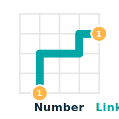

.. _index:

NumberLink Documentation
=================================

   NumberLink connects matching endpoints with non overlapping paths on a grid.

:mod:`numberlink` provides a `Gymnasium <https://gymnasium.farama.org/>`_ RGB environment, a vectorized batch variant, and a pygame viewer described in :doc:`usage`. This environment was inspired by `Puzzle Baron's NumberLinks <https://numberlinks.puzzlebaron.com>`_.

Gameplay Rules
--------------

NumberLink boards follow these invariants:

- Every pair of endpoints must be connected by a single path. Endpoints are enumerated in :class:`numberlink.level_setup.LevelTemplate` and copied into the environment state.
- Paths cannot branch or reuse grid cells. The environment enforces this through the action mask returned by :meth:`numberlink.env.NumberLinkRGBEnv.reset` and :meth:`numberlink.env.NumberLinkRGBEnv.step`.
- Unless the chosen variant disables the requirement, every cell must belong to a path. Toggle this rule with :attr:`numberlink.config.VariantConfig.must_fill`.
- Bridge cells yield independent vertical and horizontal lanes governed by :attr:`numberlink.config.VariantConfig.bridges_enabled`.
- Diagonal moves are allowed only when :attr:`numberlink.config.VariantConfig.allow_diagonal` is set. Cell switching is controlled by :attr:`numberlink.config.VariantConfig.cell_switching_mode`.

Quick Install
-------------

Install the published package from `PyPI <https://pypi.org/project/numberlink/>`_:

.. code-block:: console

   pip install numberlink

For a reproducible workflow, `uv <https://docs.astral.sh/uv/>`_ can manage the virtual environment and dependencies:

.. code-block:: console

   uv pip install numberlink

See :doc:`installation` for Conda, Pixi, and source builds.

Quick Start
-----------

Explore the workflows below or launch the interactive `Google Colab example <https://colab.research.google.com/github/misaghsoltani/NumberLink/blob/main/notebooks/numberlink_quickstart.ipynb>`_.

Programmatic setup
~~~~~~~~~~~~~~~~~~

.. code-block:: python

   import gymnasium as gym

   # Gymnasium discovers NumberLinkRGB-v0 through the package entry points
   env = gym.make("NumberLinkRGB-v0", render_mode="rgb_array")

   observation, info = env.reset(seed=42)
   action_mask = info["action_mask"]
   terminated = False
   truncated = False
   while not (terminated or truncated):
      action = env.action_space.sample(mask=action_mask)
      observation, reward, terminated, truncated, info = env.step(action)
      action_mask = info["action_mask"]
   env.close()

When running from source or a notebook, register the id in process with :func:`numberlink.registration.register_numberlink_v0` before calling :func:`gymnasium.make`.

Vectorized execution
~~~~~~~~~~~~~~~~~~~~

.. code-block:: python

   import gymnasium as gym

   vec_env = gym.make_vec("NumberLinkRGB-v0", num_envs=4, render_mode="rgb_array")

   observations, infos = vec_env.reset(seed=7)
   actions = [vec_env.single_action_space.sample(mask=mask) for mask in infos["action_mask"]]
   observations, rewards, terminated, truncated, infos = vec_env.step(actions)
   vec_env.close()

Single environments and vector environments share :class:`numberlink.config.GeneratorConfig`, :class:`numberlink.config.VariantConfig`, and :class:`numberlink.config.RenderConfig`. See :doc:`usage` for parameter tables and composition utilities in :mod:`numberlink.level_setup`.

Human mode viewer
~~~~~~~~~~~~~~~~~

.. code-block:: python

   import gymnasium as gym
   import numberlink
   from numberlink.viewer import NumberLinkViewer

   numberlink.register_numberlink_v0()
   env = gym.make("NumberLinkRGB-v0", render_mode="human")
   viewer = NumberLinkViewer(env)
   viewer.loop()

Quick Start Visuals
~~~~~~~~~~~~~~~~~~~

The GIFs below replay :meth:`numberlink.env.NumberLinkRGBEnv.get_solution` for representative variants. Regenerate them with `examples/generate_gifs.py <https://github.com/misaghsoltani/NumberLink/blob/main/examples/generate_gifs.py>`_ or scripts based on :func:`numberlink.level_setup.build_level_template`.

.. image:: _static/gifs/quickstart_cell_switching.gif
   :alt: Cell switching variant example
   :width: 170px

.. image:: _static/gifs/quickstart_bridges_diagonal.gif
   :alt: Bridges and diagonal variant example
   :width: 170px

.. toctree::
   :maxdepth: 2

   installation
   usage
   apidocs/index

Indices
-------

* :ref:`genindex`
* :ref:`modindex`
